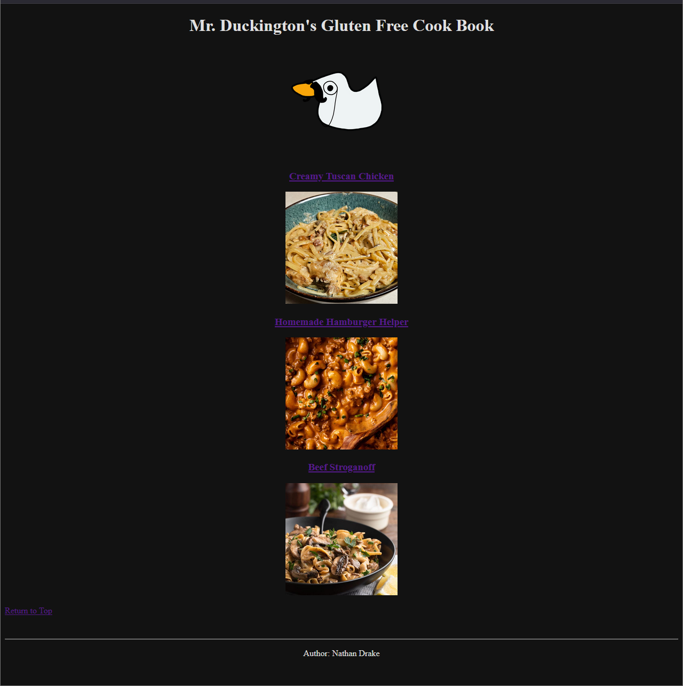
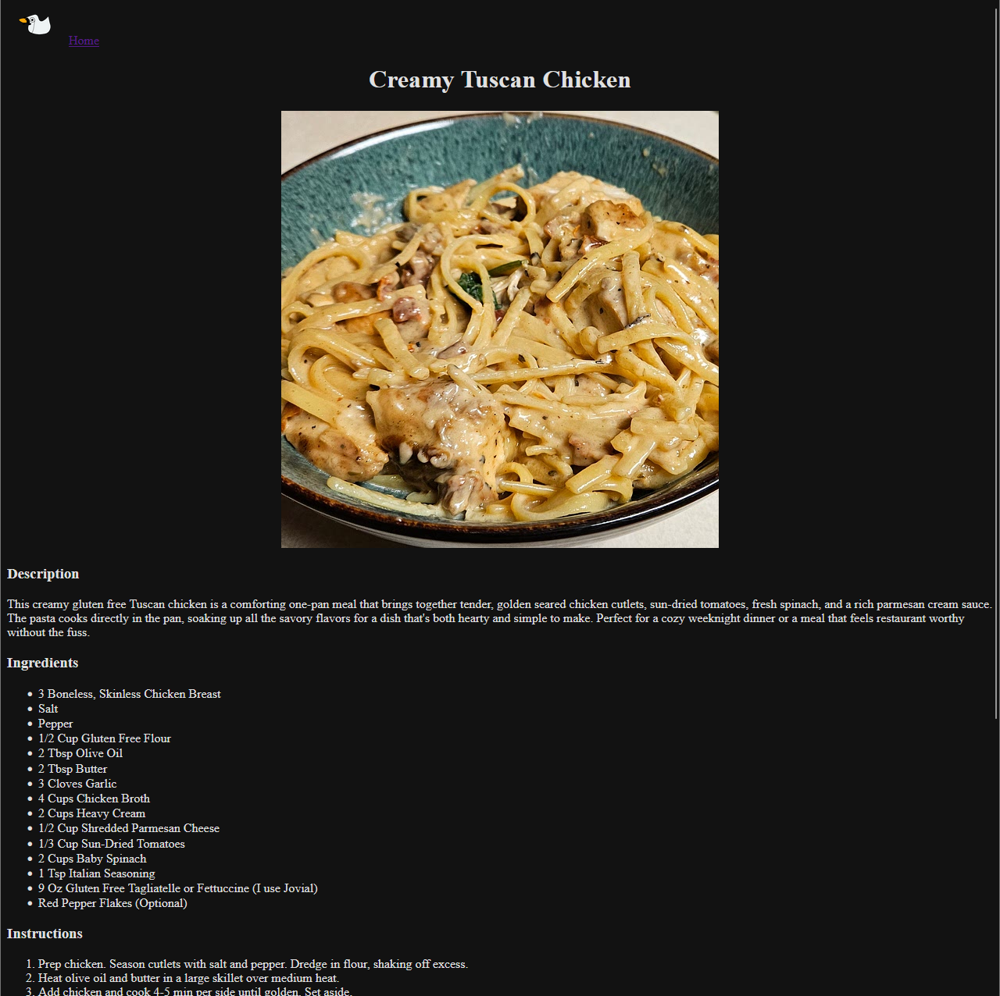
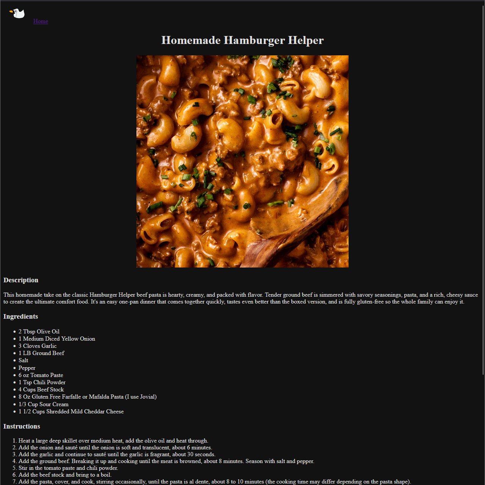
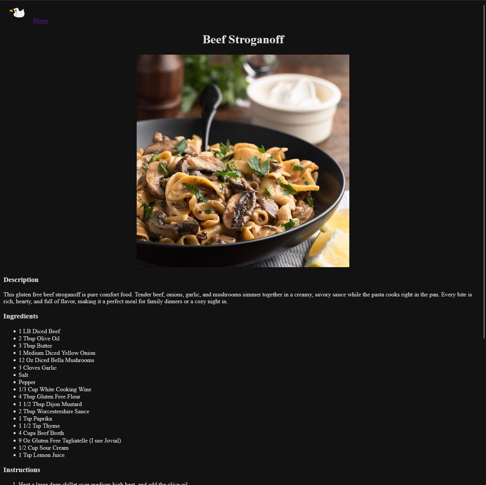

# Mr. Duckington's Gluten Free Cook Book

A simple HTML project showcasing a collection of gluten free recipes.  
This project was built as part of **The Odin Project** curriculum to practice basic HTML structure, linking pages, working with images, and creating a small multi-page website.

---

## Project Overview
This site contains:
- A **homepage** with links and images for each recipe.
- Individual **recipe pages** with:
  - A description
  - Ingredients list
  - Step-by-step instructions
  - Notes section
- A consistent navigation structure with links back to the homepage and a “Return to Top” option.

All recipes are designed to be **gluten free**, making this site both a learning project and a functional recipe reference.

---

## 📸 Preview

### Homepage


### Recipe Pages







---

## 📂 File Structure
```
odin-recipes/
│
├── index.html
├── recipes/
│ ├── creamy-tuscan-chicken.html
│ ├── hamburger-helper.html## 📸 Preview
│ └── beef-stroganoff.html
└── images/
    ├── Mr-Duckington.png
    ├── creamy-tuscan-chicken.png
    ├── hamburger-helper.png
    ├── beef-stroganoff.png
    ├── homepage-preview.png
    ├── hamburger-helper-preview.png
    ├── creamy-tuscan-chicken-preview.png
    └── beef-stroganoff-preview.png
```
    
---

## 🛠️ Built With
- **HTML5** only (no external frameworks)
- Semantic tags for structure
- Inline styling (`bgcolor`, `text`) for simplicity

---

## How to View
1. Clone the repository:
    ```
    git clone https://github.com/Nathan-Drake93/odin-recipes.git
    ```
2. Open `index.html` in your browser.
---
## 👤 Author
**Nathan Drake**  
[GitHub](https://github.com/Nathan-Drake93)